# Java Programming Language

1. Introduction  
2. JDK  
3. Comment  

## Introduction

***

### Java is a popular programming language, created in 1995.It is owned by Oracle, and more than 3 billion devices run Java. Java is a high-level, class-based, object-oriented programming language. It is a general-purpose programming language intended to let programmers ***write once, run anywhere*** (WORA), meaning that compiled Java code can run on all platforms that support Java without the need to recompile.[18] Java applications are typically compiled to bytecode that can run on any Java virtual machine (JVM)

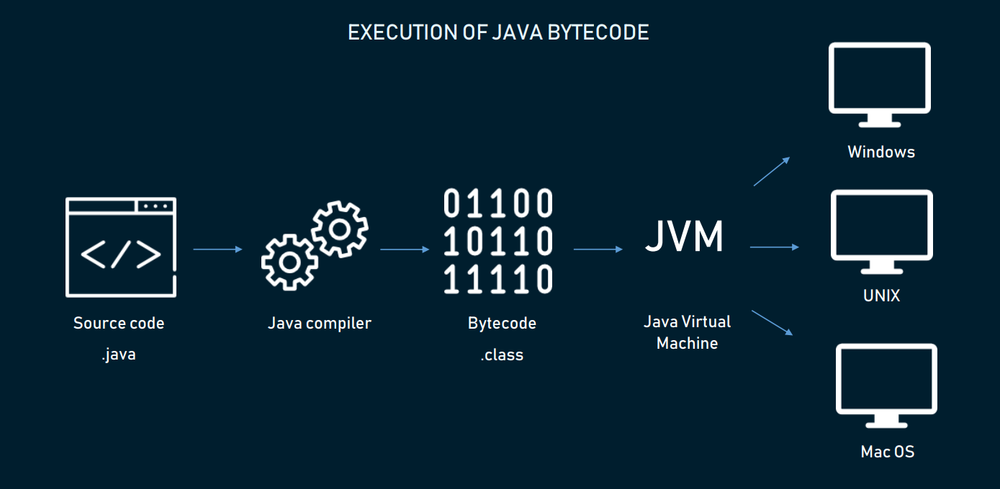

### Java programming language is used for

- Mobile application (Android app)
- Games
- Big Data (Apache Hadoop)
- Desktop application
- Web servers and application servers
- And much more

## JDK

***

### The Java Development Kit (JDK) is a distribution of Java Technology by Oracle Corporation. It implements the Java programm.It provides software for working with Java applications. Examples of included software are the virtual machine, a compiler, performance monitoring tools, a debugger, and other utilities that Oracle considers useful for a Java programmer

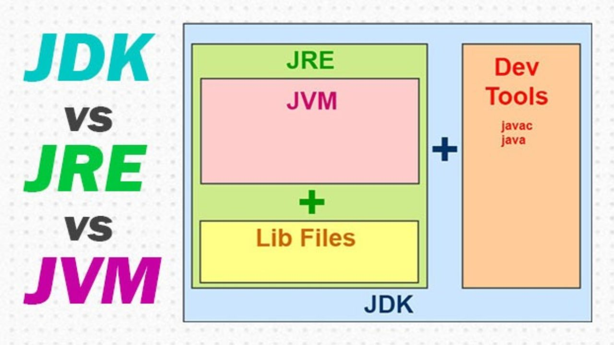

## Install JDK on macOS

***

### To install the JDK on macOS

- Download the JDK .dmg file from [Java SE Downloads]("https://www.oracle.com/java/technologies/downloads/#jdk17-mac") page.
- Click Accept License Agreement.
- From either the browser Downloads window or from the file browser, double-click the .dmg file to start it.
- A Finder window appears that contains an icon of an open box and the name of the .pkg file.
- Double-click the JDK .pkg icon to start the installation application.
- The installation application displays the Introduction window.
- Click Continue
- The Installation Type window appears. Click Install.
- A window appears that displays the message: Installer is trying to install new software. Enter your password to allow this.
- Enter the Administrator user name and password and click Install Software.
- The software is installed and a confirmation window is displayed.

## Install Intellij Idea

***

### IntelliJ is an integrated development environment(IDE) written in Java. It is used for developing computer software. This IDE is developed by Jetbrains and is available as an Apache 2 Licensed community edition and a commercial edition

### Installation on Mac: The following steps can be followed to install the IntelliJ on a MAC Operating system

- Navigate [to this]("https://www.jetbrains.com/idea/") link to get the IntelliJ software.
- Click on Download option.
- In the next screen, select the platform as Mac and select the edition which you want to download.
- Save the downloaded file in the desired location.
- Open the downloaded file. A message pops up on the screen which says verifying and opening. After this screen pops up, drag and drop the IntelliJ to the Applications folder.
- After dragging and dropping it into the applications folder, the following screen is obtained:

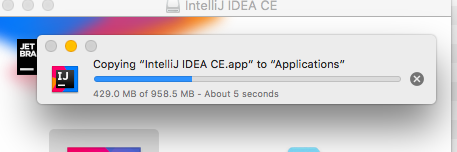

- You can add IntelliJ to Mac’s dock by

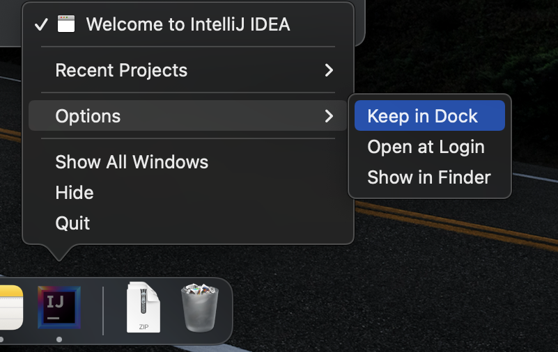

## Hello World programm in IntelliJ IDEA

***

- Open an IntelliJ IDEA


- Click New  Project
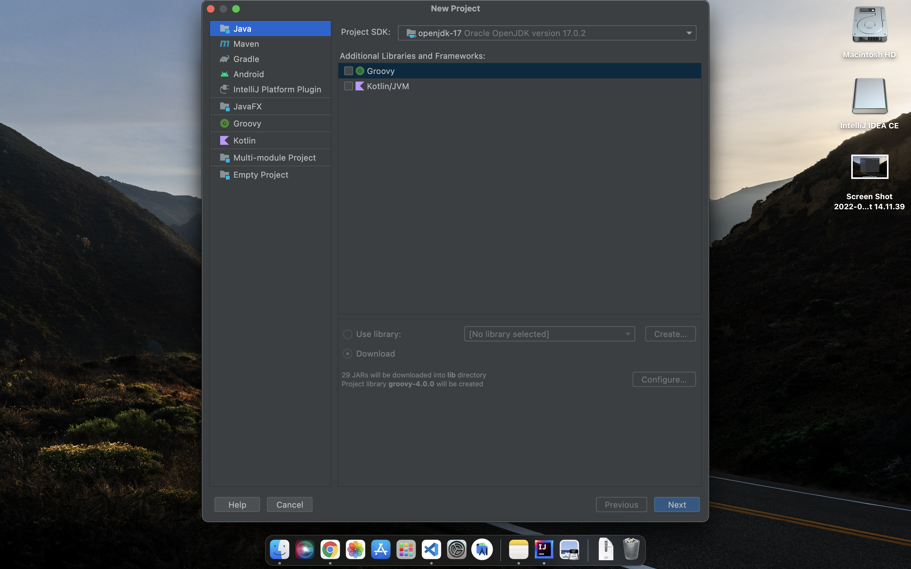

- Click Next
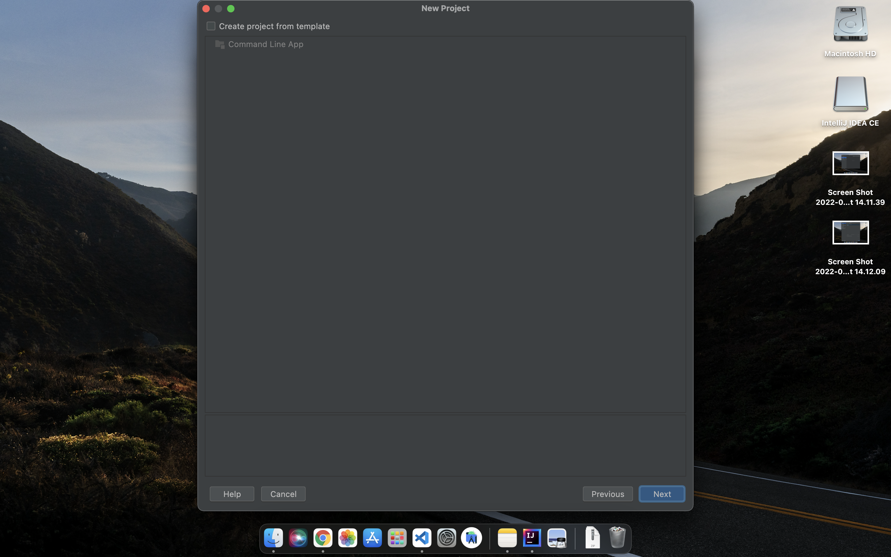

- Click Next
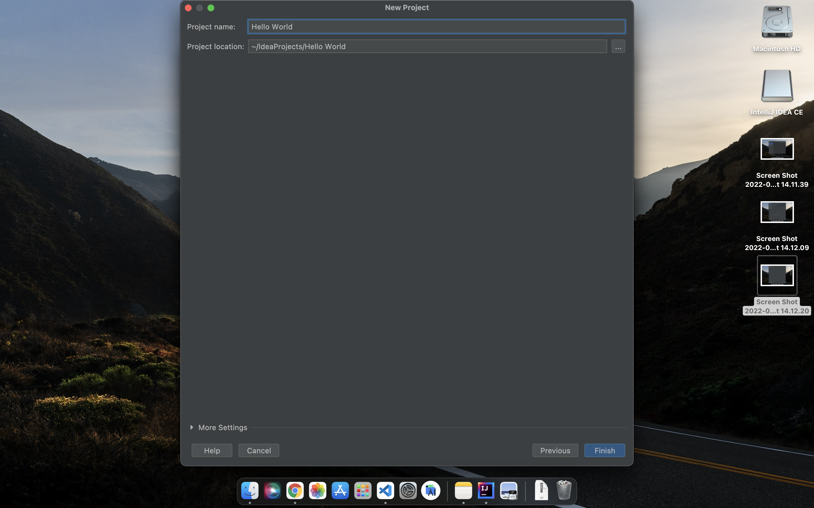

- Enter "Hello World" to Project name and click Finish

## And this window appear

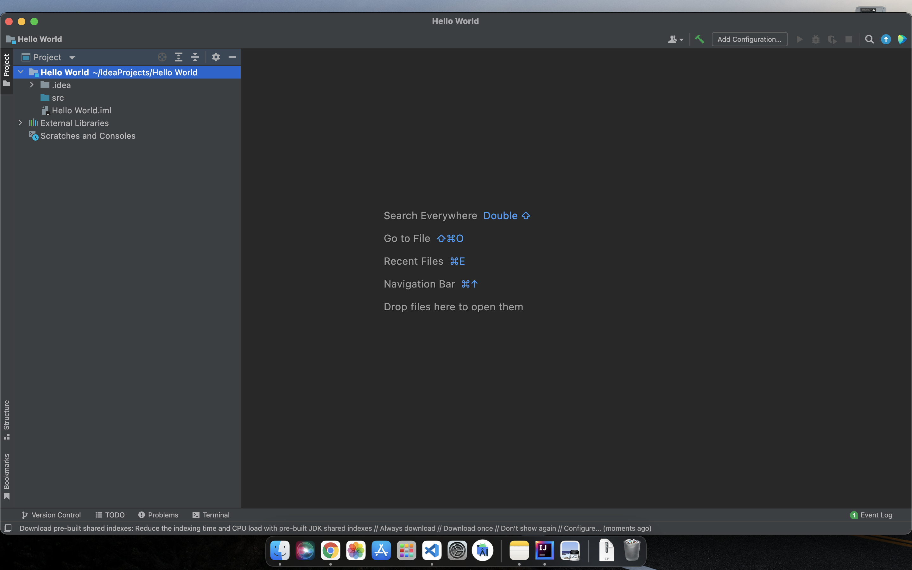

- Click right click on a src folder and New Java Class
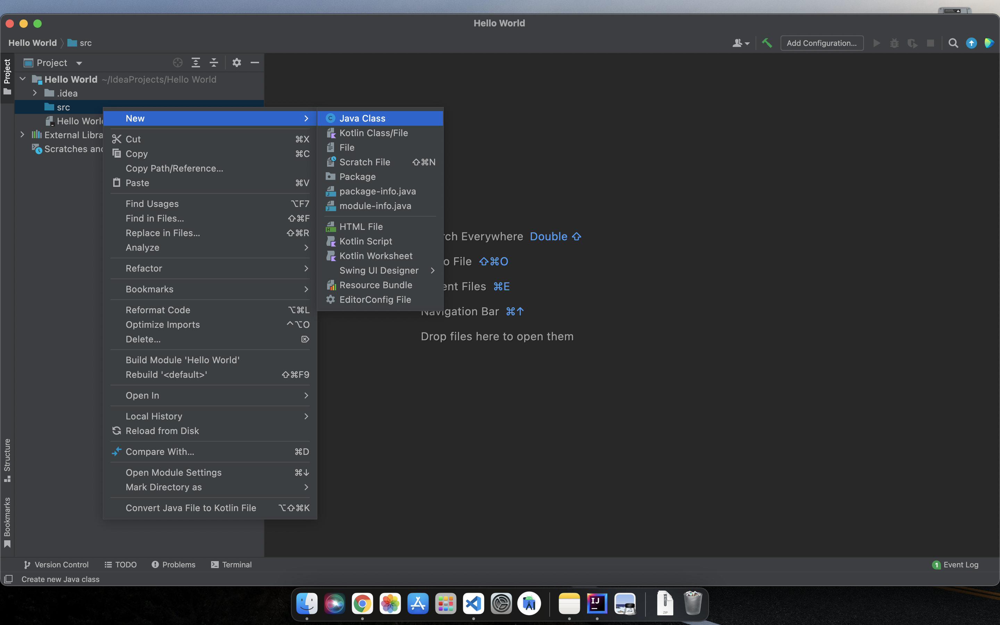

- Then Enter "Main" to New Java Class
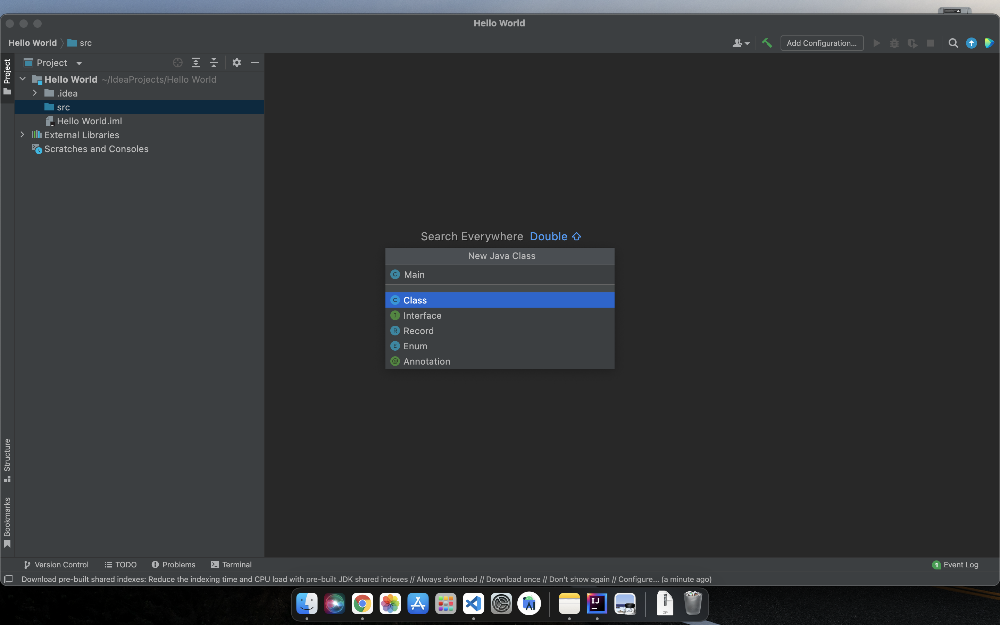

- Your java class apppear in window
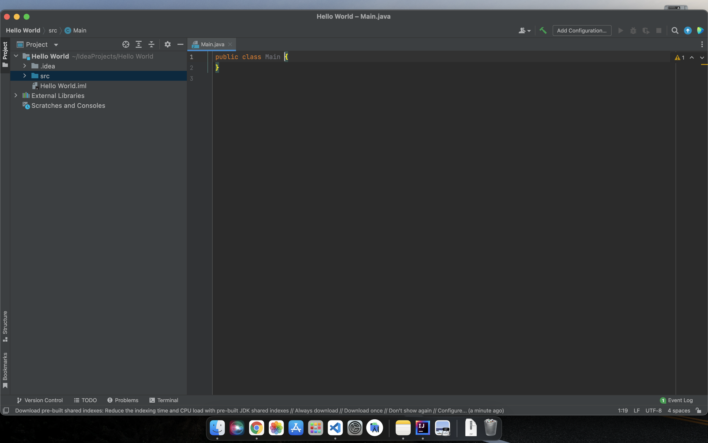

- Then put in this code to Main class and run it with green rectengle button 

```java
public static void main(String args[]){
        System.out.println("Hello world");
}
```

### In the end your programm should look like this

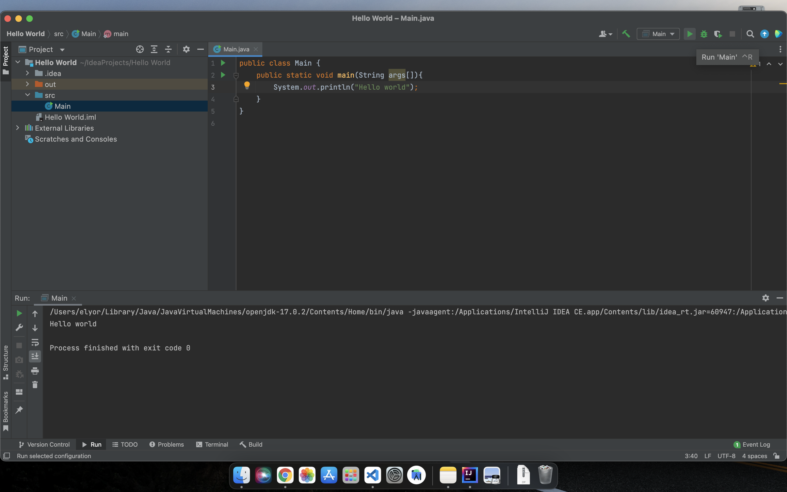

## Comment

***

> - Single line comment

```java
public class Main {
  public static void main(String[] args) {
    // This is a single line comment
    System.out.println("Hello World");
  }
}
```

> - Multi line comment

```java
public class Main {
  public static void main(String[] args) {
    /* The code below will print the words Hello World
    to the screen, and it is amazing */
    System.out.println("Hello World");
  }
}
```

## Data types

***

>### Primitive Data & Non-Primitive

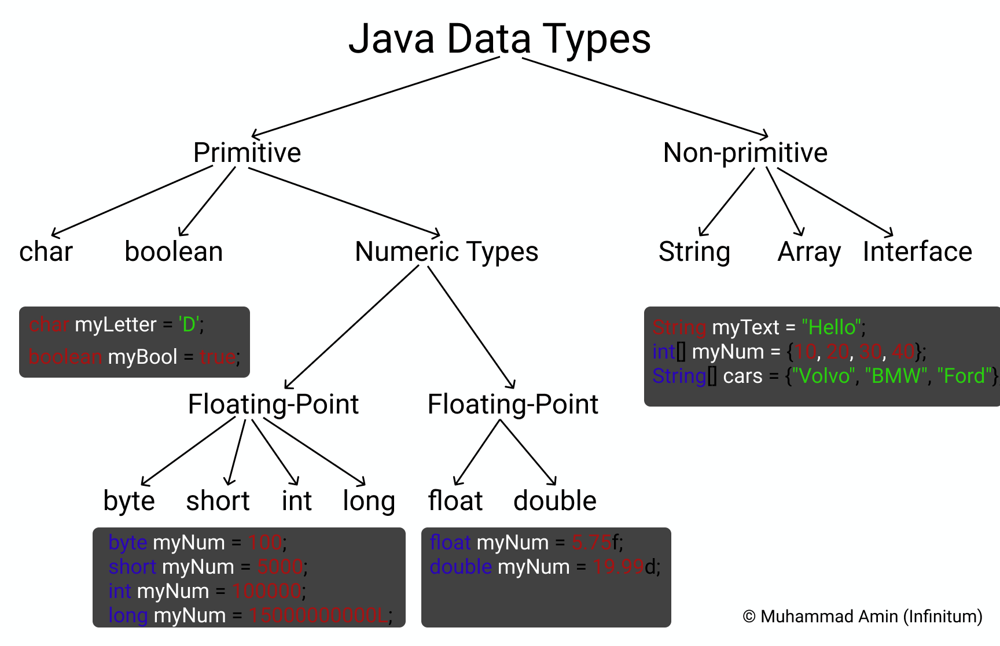

> Examples

```java
import java.util.Arrays;

public class Main {
    public static void main(String[] args) {
        //Primitive
        char myChar = 'V';
        boolean myBoolean = true;
        byte myByte = 127;
        short myShort = 32767;
        int myInt = 2147483647;
        long myLong = 9223372036854775807L;
        float myFloat = 8.93f;
        double myDouble = 1234.5678d;
        //Non-Primitive
        String myText = "Hello";
        int[] myIntArray = new int[] {2, 4, 7};
        String[] myStringArray = new String[] {"Apple", "Banana", "Kiwi"};
        //print primitive
        System.out.println(myChar);
        System.out.println(myBoolean);
        System.out.println(myByte);
        System.out.println(myShort);
        System.out.println(myInt);
        System.out.println(myLong);
        System.out.println(myFloat);
        System.out.println(myDouble);
        //print non-primitive
        System.out.println(myText);
        System.out.println(Arrays.toString(myIntArray));
        System.out.println(Arrays.toString(myStringArray));
    }
}
```

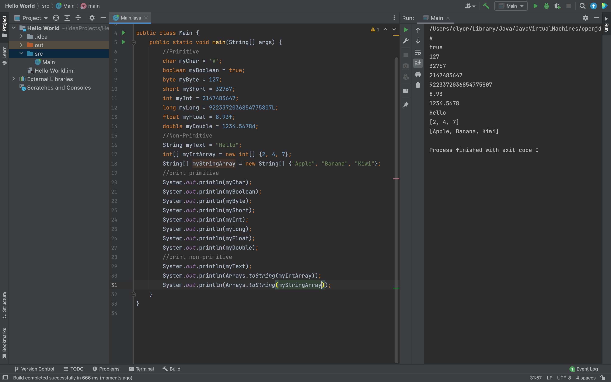
