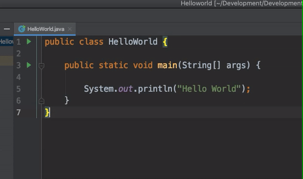

# **Java Course Outline**



> - *Java Introduction*
> - Syntax & Hello world
> - Comment
> - Variables

1. Introduction  
    [1.1 What is a Java](https://www.w3schools.com/java/java_intro.asp)  
    1.2 Why is a Java
2. Comment  
    2.1 Single line comment  
    2.2 Multi line comment
3. Variables  
    3.1 String  
    3.2 Integer

***

- **Introduction**
  - What is a java
  - Why is a Java

[](https://www.w3schools.com/java/java_comments.asp)

> Hello world programm
>> This is aprogramm

```java
public class Main {
  public static void main(String[] args) {
    System.out.println("Hello World");
  }
}
```
